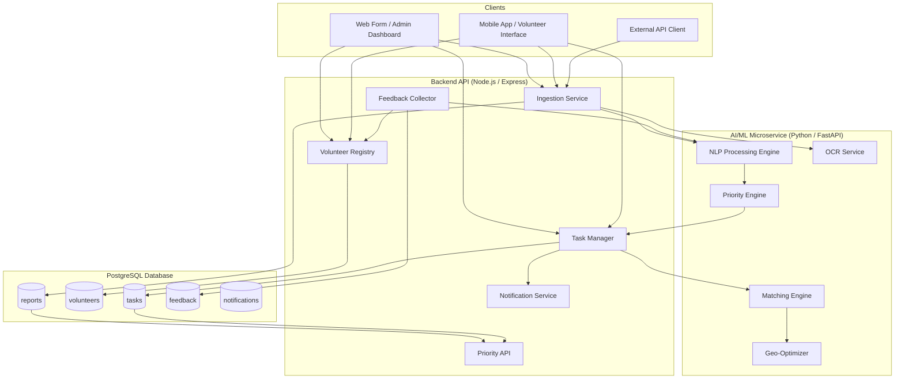
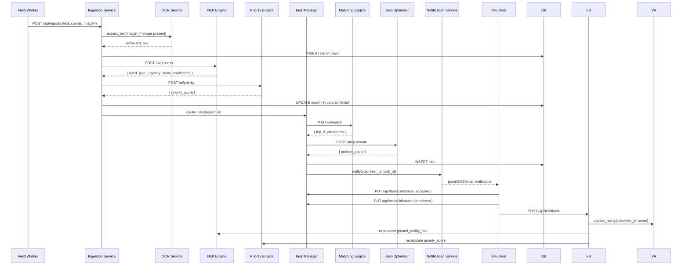
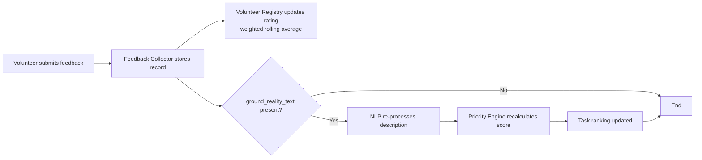

# Design Document: Smart Resource Allocation — Volunteer Coordination Platform

## Overview

This document describes the technical design for the Smart Resource Allocation Volunteer Coordination Platform — an AI-powered system that ingests community need reports, structures them via NLP, prioritizes them, matches volunteers, optimizes routes, and closes the loop through feedback.

The system is built as a set of loosely coupled services communicating over REST APIs. The AI/ML logic lives in a dedicated Python microservice; the web layer is Next.js; the API layer is Node.js (Express); and all persistent state lives in PostgreSQL.

The three source datasets drive both model training and runtime validation:
- `reports_dataset_large.csv` — NLP training data and priority score ground truth
- `volunteers_dataset_large.csv` — volunteer profiles for matching engine
- `tasks_dataset_large.csv` — task records for priority validation and matching evaluation

---

## Architecture

### High-Level Component Diagram



### Service Responsibilities

| Service | Language | Responsibility |
|---|---|---|
| Backend API | Node.js / Express | HTTP routing, auth, orchestration |
| AI/ML Microservice | Python / FastAPI | NLP, priority, matching, geo |
| Frontend | Next.js (React) | Admin dashboard, volunteer interface |
| Database | PostgreSQL | All persistent state |

### Communication Pattern

All inter-service communication is synchronous REST over HTTP. The Backend API calls the AI Microservice for processing tasks. The AI Microservice never calls back into the Backend API — it is purely a computation service.

---

## Components and Interfaces

### 1. Ingestion Service

Accepts reports from web form, mobile app, and REST API. Validates required fields (text description + location). Calls OCR Service for image attachments. Persists raw report to `reports` table. Triggers async NLP processing.

**Interface:**
```
POST /api/reports
Body: { text, latitude, longitude, image_attachment? }
Response 201: { report_id }
Response 400: { error, missing_fields[] }
```

### 2. NLP Processing Engine (AI Microservice)

Receives raw report text. Runs DistilBERT classification + regression heads. Falls back to rule-based extraction when confidence < 0.6. Returns structured fields.

**Interface:**
```
POST /ai/process
Body: { report_id, text }
Response 200: { need_type, urgency_score, people_affected, confidence }
```

### 3. Priority Engine (AI Microservice)

Computes priority score from structured fields using the weighted formula. Normalizes inputs. Returns score and ranking.

**Interface:**
```
POST /ai/priority
Body: { report_id, urgency_score, people_affected, timestamp }
Response 200: { priority_score, is_complete }

GET /ai/priority/ranked
Response 200: { reports: [{ report_id, priority_score }] }
```

### 4. Matching Engine (AI Microservice)

Filters available volunteers, computes Haversine distance, scores skill match, returns top 3.

**Interface:**
```
POST /ai/match
Body: { task_id, need_type, latitude, longitude, required_time_window }
Response 200: { matches: [{ volunteer_id, match_score, skill_score, distance_km, rating }] }
```

### 5. Geo-Optimizer (AI Microservice)

Clusters tasks with K-Means. Computes nearest-neighbor route for a volunteer's task set.

**Interface:**
```
POST /ai/geo/cluster
Body: { tasks: [{ task_id, latitude, longitude }] }
Response 200: { clusters: [{ cluster_id, task_ids[], centroid }] }

POST /ai/geo/route
Body: { volunteer_id, task_ids[] }
Response 200: { route: [{ task_id, latitude, longitude, estimated_travel_minutes }], is_approximate }
```

### 6. Volunteer Registry

CRUD for volunteer profiles. Exposes filterable list endpoint.

**Interface:**
```
POST   /api/volunteers          → 201 { volunteer_id }
GET    /api/volunteers/:id      → 200 { volunteer profile }
PUT    /api/volunteers/:id      → 200 { updated profile }
GET    /api/volunteers?skill=&available=&bbox= → 200 { volunteers[] }
```

### 7. Task Manager

Creates, updates, and queries tasks. Triggers re-matching for stale pending tasks.

**Interface:**
```
POST   /api/tasks               → 201 { task_id }
GET    /api/tasks/:id           → 200 { task }
PUT    /api/tasks/:id/status    → 200 { task }
GET    /api/tasks?status=&volunteer=&region= → 200 { tasks[] }
```

### 8. Feedback Collector

Stores post-task feedback. Triggers rating update and priority recalculation.

**Interface:**
```
POST /api/feedback              → 201 { feedback_id }
GET  /api/feedback/metrics?volunteer=&task_type= → 200 { metrics }
```

### 9. Notification Service

Sends assignment notifications via the volunteer's preferred channel (push / SMS / email).

**Interface (internal):**
```
POST /internal/notify
Body: { volunteer_id, task_id, channel }
```

---

## Data Models

### reports table

```sql
CREATE TABLE reports (
    report_id        VARCHAR(20)   PRIMARY KEY,
    raw_text         TEXT          NOT NULL,
    image_url        TEXT,
    latitude         DOUBLE PRECISION NOT NULL,
    longitude        DOUBLE PRECISION NOT NULL,
    submitted_at     TIMESTAMPTZ   NOT NULL DEFAULT NOW(),
    -- structured fields (populated by AI Processing Engine)
    need_type        VARCHAR(50),
    urgency_score    DOUBLE PRECISION CHECK (urgency_score BETWEEN 0 AND 10),
    people_affected  INTEGER,
    priority_score   DOUBLE PRECISION CHECK (priority_score BETWEEN 0 AND 10),
    -- flags
    is_flagged_review   BOOLEAN DEFAULT FALSE,
    is_incomplete_score BOOLEAN DEFAULT FALSE,
    duplicate_score     DOUBLE PRECISION,
    duplicate_of        VARCHAR(20) REFERENCES reports(report_id),
    processing_status   VARCHAR(20) DEFAULT 'pending'
        CHECK (processing_status IN ('pending','processing','done','failed'))
);
```

### volunteers table

```sql
CREATE TABLE volunteers (
    volunteer_id   VARCHAR(20)   PRIMARY KEY,
    name           VARCHAR(255)  NOT NULL,
    email          VARCHAR(255)  UNIQUE NOT NULL,
    phone          VARCHAR(30),
    skills         TEXT[]        NOT NULL,
    latitude       DOUBLE PRECISION NOT NULL,
    longitude      DOUBLE PRECISION NOT NULL,
    availability   BOOLEAN       NOT NULL DEFAULT TRUE,
    rating         DOUBLE PRECISION DEFAULT 5.0
        CHECK (rating BETWEEN 0 AND 5),
    notification_pref VARCHAR(10) DEFAULT 'email'
        CHECK (notification_pref IN ('push','sms','email')),
    created_at     TIMESTAMPTZ   NOT NULL DEFAULT NOW(),
    updated_at     TIMESTAMPTZ   NOT NULL DEFAULT NOW()
);
```

### tasks table

```sql
CREATE TABLE tasks (
    task_id              VARCHAR(20)   PRIMARY KEY,
    report_id            VARCHAR(20)   NOT NULL REFERENCES reports(report_id),
    priority_score       DOUBLE PRECISION NOT NULL,
    status               VARCHAR(20)   NOT NULL DEFAULT 'pending'
        CHECK (status IN ('pending','in_progress','completed','cancelled')),
    assigned_volunteer_ids TEXT[],
    required_skills      TEXT[],
    latitude             DOUBLE PRECISION NOT NULL,
    longitude            DOUBLE PRECISION NOT NULL,
    required_time_window TSTZRANGE,
    is_understaffed      BOOLEAN DEFAULT FALSE,
    created_at           TIMESTAMPTZ   NOT NULL DEFAULT NOW(),
    accepted_at          TIMESTAMPTZ,
    completed_at         TIMESTAMPTZ,
    last_rematched_at    TIMESTAMPTZ
);
```

### feedback table

```sql
CREATE TABLE feedback (
    feedback_id          VARCHAR(20)   PRIMARY KEY,
    task_id              VARCHAR(20)   NOT NULL REFERENCES tasks(task_id),
    volunteer_id         VARCHAR(20)   NOT NULL REFERENCES volunteers(volunteer_id),
    report_id            VARCHAR(20)   NOT NULL REFERENCES reports(report_id),
    completion_status    VARCHAR(20)   NOT NULL
        CHECK (completion_status IN ('success','partial','failed')),
    ground_reality_text  TEXT,
    difficulty_rating    INTEGER       CHECK (difficulty_rating BETWEEN 1 AND 5),
    submitted_at         TIMESTAMPTZ   NOT NULL DEFAULT NOW()
);
```

### notifications table

```sql
CREATE TABLE notifications (
    notification_id  VARCHAR(20)   PRIMARY KEY,
    volunteer_id     VARCHAR(20)   NOT NULL REFERENCES volunteers(volunteer_id),
    task_id          VARCHAR(20)   NOT NULL REFERENCES tasks(task_id),
    channel          VARCHAR(10)   NOT NULL,
    sent_at          TIMESTAMPTZ,
    responded_at     TIMESTAMPTZ,
    response         VARCHAR(10)   CHECK (response IN ('accepted','rejected',NULL))
);
```

---

## AI Module Designs

### Module 1: NLP Processing Engine

**Model Architecture**

```
raw_text
    │
    ▼
Preprocessing (lowercase, strip, BERT tokenizer)
    │
    ▼
DistilBERT base (shared encoder, frozen lower layers)
    │
    ├──► Classification Head → need_type (food/medical/shelter/education/water)
    │    (Linear → Softmax, 5 classes)
    │
    └──► Regression Head → urgency_score (0.0–1.0)
         (Linear → Sigmoid)
```

**Training Data:** `reports_dataset_large.csv` columns `text`, `need_type`, `urgency_score`

**Preprocessing Pipeline:**
1. Lowercase all text
2. Strip punctuation and extra whitespace
3. Tokenize with `DistilBertTokenizer` (max_length=128, padding, truncation)
4. Return `input_ids`, `attention_mask`

**Fallback Rule-Based Extraction (confidence < 0.6):**

```python
KEYWORD_MAP = {
    "food":      ["food", "starving", "hunger", "eat", "meal"],
    "medical":   ["medical", "sick", "hospital", "injury", "medicine"],
    "shelter":   ["shelter", "homeless", "house", "roof", "displaced"],
    "education": ["school", "students", "education", "teacher", "class"],
    "water":     ["water", "drinking", "flood", "sanitation"],
}
```

Urgency fallback: count urgency keywords ("urgent", "critical", "emergency", "immediately") → map count to 0.0–1.0 scale.

**Output:** `{ need_type, urgency_score, people_affected, confidence_need_type, confidence_urgency }`

---

### Module 2: Priority Engine

**Formula:**

```
priority_score = (urgency_score × 0.5)
              + (people_affected_normalized × 0.3)
              + (time_delay_normalized × 0.2)
```

**Normalization:**
- `people_affected_normalized = min(people_affected / MAX_PEOPLE, 1.0) × 10`
  - `MAX_PEOPLE` = 95th percentile of `people_affected` in `reports_dataset_large.csv`
- `time_delay_normalized = min(hours_since_report / MAX_HOURS, 1.0) × 10`
  - `MAX_HOURS` = 72 (3 days)
- `urgency_score` is already 0–1 from NLP; multiply by 10 for formula

**Null handling:** Any null input → substitute 0, set `is_incomplete_score = True`

**Validation:** Cross-validate computed scores against `priority_score` column in `tasks_dataset_large.csv` using MAE metric.

---

### Module 3: Volunteer Matching Engine

**Pipeline:**

```
Step 1: Filter  → availability == True
Step 2: Filter  → skill overlap with need_type > 0
Step 3: Score   → compute match_score for each candidate
Step 4: Sort    → descending by match_score
Step 5: Return  → top 3 (or all if < 3)
```

**Match Score Formula:**

```
match_score = (skill_match × 0.4)
            + (distance_score × 0.3)
            + (rating_normalized × 0.3)
```

- `skill_match`: binary 1.0 if volunteer skill == need_type, else 0.0 (extensible to partial)
- `distance_score = max(0, 1 - (haversine_km / MAX_DISTANCE_KM))` where `MAX_DISTANCE_KM = 50`
- `rating_normalized = volunteer.rating / 5.0`

**Haversine Distance:**

```python
def haversine(lat1, lon1, lat2, lon2) -> float:
    R = 6371  # Earth radius km
    dlat = radians(lat2 - lat1)
    dlon = radians(lon2 - lon1)
    a = sin(dlat/2)**2 + cos(radians(lat1)) * cos(radians(lat2)) * sin(dlon/2)**2
    return R * 2 * asin(sqrt(a))
```

**Determinism guarantee:** Sort is stable; ties broken by `volunteer_id` lexicographic order.

---

### Module 4: Geo-Optimizer

**Task Clustering (K-Means):**

```python
from sklearn.cluster import KMeans
import numpy as np

coords = np.array([[t.latitude, t.longitude] for t in tasks])
k = max(1, len(tasks) // 5)   # ~5 tasks per cluster
kmeans = KMeans(n_clusters=k, random_state=42)
labels = kmeans.fit_predict(coords)
```

**Route Optimization (Nearest-Neighbor):**

```python
def nearest_neighbor_route(start_lat, start_lon, tasks):
    unvisited = list(tasks)
    route = []
    current = (start_lat, start_lon)
    while unvisited:
        nearest = min(unvisited, key=lambda t: haversine(*current, t.lat, t.lon))
        route.append(nearest)
        current = (nearest.lat, nearest.lon)
        unvisited.remove(nearest)
    return route
```

Travel time estimate: `distance_km / AVG_SPEED_KMH × 60` minutes, where `AVG_SPEED_KMH = 30`.

**Cluster recomputation trigger:** Fired when `|new_count - last_count| / last_count > 0.10`.

---

## Data Flow Diagrams

### End-to-End Report Processing Flow



### Feedback Loop Flow



---

## Technology Stack

| Layer | Technology | Rationale |
|---|---|---|
| Frontend | Next.js 14 (React) | SSR for dashboard performance, strong ecosystem |
| Backend API | Node.js + Express | Lightweight, fast I/O, easy REST routing |
| AI Microservice | Python 3.11 + FastAPI | PyTorch, scikit-learn, pandas native support |
| NLP Model | DistilBERT (HuggingFace) | 40% smaller than BERT, 97% accuracy, fast inference |
| ML Libraries | PyTorch, scikit-learn, pandas | Standard ML stack |
| Database | PostgreSQL 15 | ACID, array types for skills, PostGIS-ready |
| Distance Calc | Haversine (pure Python) | No external API dependency |
| Clustering | scikit-learn KMeans | Deterministic with fixed random_state |
| Containerization | Docker + docker-compose | Reproducible local and production environments |

---

## Correctness Properties

*A property is a characteristic or behavior that should hold true across all valid executions of a system — essentially, a formal statement about what the system should do. Properties serve as the bridge between human-readable specifications and machine-verifiable correctness guarantees.*

### Property 1: Report Ingestion Uniqueness

*For any* set of N valid report submissions, all N assigned report identifiers SHALL be distinct.

**Validates: Requirements 1.7**

---

### Property 2: Report Acceptance for Valid Inputs

*For any* report containing a non-empty text description and valid geographic coordinates, the Ingestion Service SHALL return a 2xx response.

**Validates: Requirements 1.3**

---

### Property 3: Rejection of Incomplete Reports

*For any* report submission missing at least one required field (text description or location), the Ingestion Service SHALL return a 400 response.

**Validates: Requirements 1.6**

---

### Property 4: NLP Urgency Score Range Invariant

*For any* valid report text, the urgency score produced by the NLP Processing Engine SHALL satisfy `0.0 <= urgency_score <= 1.0`.

**Validates: Requirements 2.4**

---

### Property 5: NLP Processing Idempotence

*For any* valid raw report text, processing the text twice SHALL produce equivalent structured output — same `need_type`, same `urgency_score` (within floating-point tolerance).

**Validates: Requirements 2.7**

---

### Property 6: NLP Fallback Activation

*For any* report text where the NLP model returns a confidence score below 0.6 for any field, the structured output for that field SHALL be produced by the rule-based fallback extractor, not the NLP model.

**Validates: Requirements 2.3**

---

### Property 7: Structured Output Persistence

*For any* processed report, retrieving the report from the database SHALL return both the original raw text and all structured fields produced by the AI Processing Engine.

**Validates: Requirements 2.6**

---

### Property 8: Priority Score Formula Correctness

*For any* structured report with known `urgency_score`, `people_affected`, and `timestamp`, the computed `priority_score` SHALL equal `(urgency_normalized × 0.5) + (people_normalized × 0.3) + (time_delay_normalized × 0.2)` within floating-point tolerance.

**Validates: Requirements 3.1**

---

### Property 9: Priority Score Range Invariant

*For any* valid structured report (including those with null inputs substituted with 0), the computed `priority_score` SHALL satisfy `0.0 <= priority_score <= 10.0`.

**Validates: Requirements 3.3**

---

### Property 10: Normalization Range Invariant

*For any* `people_affected` value and `time_delay` value, the normalized outputs SHALL satisfy `0.0 <= normalized_value <= 10.0`.

**Validates: Requirements 3.2**

---

### Property 11: Priority Ranking Order Invariant

*For any* set of active reports, the ranked list returned by the Priority Engine SHALL be sorted in descending order by `priority_score` — i.e., `list[i].priority_score >= list[i+1].priority_score` for all valid indices `i`.

**Validates: Requirements 3.4**

---

### Property 12: Volunteer Profile Round-Trip

*For any* valid volunteer profile, creating the profile and then retrieving it by ID SHALL return an equivalent profile with all fields preserved.

**Validates: Requirements 4.1**

---

### Property 13: Volunteer Filter Correctness

*For any* combination of skill, availability, and bounding-box filters, every volunteer returned by the registry SHALL satisfy all specified filter criteria simultaneously.

**Validates: Requirements 4.4**

---

### Property 14: Volunteer Missing-Field Rejection

*For any* volunteer profile creation request missing at least one required field (name, contact, skill, or location), the Volunteer Registry SHALL return a 400 response.

**Validates: Requirements 4.5**

---

### Property 15: Volunteer Rating Update Correctness

*For any* sequence of feedback scores submitted for a volunteer, the volunteer's stored rating SHALL equal the weighted rolling average of all feedback scores received.

**Validates: Requirements 4.6, 11.2**

---

### Property 16: Match Score Formula Correctness

*For any* task and available volunteer, the computed `match_score` SHALL equal `(skill_match × 0.4) + (distance_score × 0.3) + (rating_normalized × 0.3)` within floating-point tolerance.

**Validates: Requirements 5.1**

---

### Property 17: Matching Returns Top Candidates

*For any* task and volunteer pool with at least 3 available volunteers, the Matching Engine SHALL return exactly the 3 volunteers with the highest `match_score` values.

**Validates: Requirements 5.2**

---

### Property 18: Matching Availability Filter

*For any* task, every volunteer returned by the Matching Engine SHALL have `availability == True` and a time window overlapping the task's required window.

**Validates: Requirements 5.3**

---

### Property 19: Matching Determinism

*For any* task and volunteer pool, running the Matching Engine twice with identical inputs SHALL produce identical ranked lists in identical order.

**Validates: Requirements 5.6**

---

### Property 20: Geo-Clustering Partition Invariant

*For any* set of active tasks, the K-Means clustering output SHALL assign each task to exactly one cluster — no task is unassigned and no task appears in multiple clusters.

**Validates: Requirements 6.1**

---

### Property 21: Route Completeness

*For any* set of task locations assigned to a volunteer, the computed route SHALL contain every task exactly once.

**Validates: Requirements 6.2**

---

### Property 22: Route Travel Times Non-Negative

*For any* computed route, all estimated travel times between consecutive stops SHALL be greater than or equal to zero.

**Validates: Requirements 6.3**

---

### Property 23: Task Status Machine Invariant

*For any* task at any point in its lifecycle, its `status` field SHALL be one of `{pending, in_progress, completed, cancelled}`.

**Validates: Requirements 7.2**

---

### Property 24: Task Status Transitions

*For any* task in `pending` status, after a volunteer accepts it, the status SHALL be `in_progress`. *For any* task in `in_progress` status, after a volunteer submits a completion report, the status SHALL be `completed`.

**Validates: Requirements 7.3, 7.4**

---

### Property 25: Task Filter Correctness

*For any* combination of status, volunteer, and region filters, every task returned by the Task Manager SHALL satisfy all specified filter criteria simultaneously.

**Validates: Requirements 7.5**

---

### Property 26: Task Creation Field Completeness

*For any* prioritized report with a confirmed volunteer match, the created task record SHALL contain all required fields: `task_id`, `report_id`, `assigned_volunteer_ids`, `required_skills`, `latitude`, `longitude`, and `status`.

**Validates: Requirements 7.1**

---

### Property 27: Notification Channel Routing

*For any* volunteer with a registered notification preference, assignment notifications SHALL be delivered via that volunteer's preferred channel.

**Validates: Requirements 8.2**

---

### Property 28: Feedback Round-Trip

*For any* feedback record, storing the record and then retrieving it by ID SHALL return an equivalent record with all fields preserved.

**Validates: Requirements 11.1, 11.5**

---

### Property 29: Priority Recalculation on Feedback

*For any* feedback submission containing an updated ground reality description, the linked report's `priority_score` SHALL be recalculated and updated in the database after processing completes.

**Validates: Requirements 11.3**

---

## Error Handling

| Scenario | Component | Behavior |
|---|---|---|
| Missing required report fields | Ingestion Service | Return 400 with list of missing fields |
| OCR failure | OCR Service | Store report with original image, flag for manual review |
| NLP confidence < 0.6 | NLP Engine | Apply rule-based fallback for that field |
| NLP + rule-based both fail | NLP Engine | Set field to null, flag report for human review |
| Null priority input | Priority Engine | Substitute 0, set `is_incomplete_score = True` |
| Fewer than 3 available volunteers | Matching Engine | Return all eligible, set `is_understaffed = True` on task |
| Routing API unavailable | Geo-Optimizer | Fall back to nearest-neighbor straight-line, set `is_approximate = True` |
| Task pending > 24 hours | Task Manager | Trigger re-matching request |
| Volunteer no response in 2 hours | Notification Service | Send reminder, flag assignment as pending response |
| Missing volunteer profile fields | Volunteer Registry | Return 400 with list of missing fields |

---

## Testing Strategy

### Dual Testing Approach

The platform uses both unit/example-based tests and property-based tests. Unit tests cover specific scenarios, integration points, and error conditions. Property-based tests verify universal invariants across randomly generated inputs.

### Property-Based Testing

**Library:** `hypothesis` (Python) for AI microservice modules; `fast-check` (TypeScript) for Node.js backend.

**Configuration:** Minimum 100 iterations per property test.

**Tag format:** `# Feature: volunteer-coordination-platform, Property N: <property_text>`

Each correctness property defined above maps to exactly one property-based test. The test generates random valid inputs, executes the relevant function, and asserts the property holds.

**Key property test targets:**
- NLP urgency score range (Property 4) — generate random text strings
- NLP idempotence (Property 5) — generate random report texts, run twice
- Priority score formula (Property 8) — generate random urgency/people/time triples
- Priority score range (Property 9) — generate random inputs including nulls
- Normalization range (Property 10) — generate random raw values
- Priority ranking order (Property 11) — generate random report sets
- Match score formula (Property 16) — generate random volunteer/task pairs
- Matching top candidates (Property 17) — generate random volunteer pools
- Matching availability filter (Property 18) — generate mixed availability pools
- Matching determinism (Property 19) — run matching twice on same input
- Geo-clustering partition (Property 20) — generate random task coordinate sets
- Route completeness (Property 21) — generate random task sets
- Task status machine (Property 23) — generate random task lifecycle sequences
- Feedback round-trip (Property 28) — generate random feedback records

### Unit / Example-Based Tests

- Ingestion: valid submission accepted, OCR failure path, missing fields rejected
- Priority: null input substitution, re-ranking after update
- Matching: under-staffed flag when < 3 volunteers
- Geo: cluster recomputation trigger at 10% threshold, fallback route flag
- Task Manager: 24-hour re-matching trigger
- Notifications: 2-hour reminder trigger
- Feedback: rating update formula with known values

### Integration Tests

- End-to-end report submission → NLP → priority → task creation → matching → notification
- Feedback submission → rating update → priority recalculation
- Admin dashboard data refresh within 30 seconds of data change
